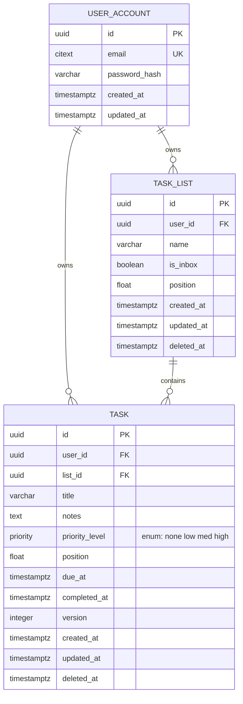

# Locked Decisions for Story 1ce7392f-5abc-4314-a441-d7843cec3678

## Implementation Approach
## Implementation Approach — Create a Task

### Layer Breakdown

**Controller — `TaskController`**
- `@RestController` + `@RequestMapping("/v1/tasks")`
- `@PostMapping` method: `createTask(@Valid @RequestBody CreateTaskRequest request, @CurrentUser UUID userId)`
- Returns `ResponseEntity<TaskResponse>` with status 201 and `Location` header
- No business logic — delegates entirely to `TaskService`

**Service — `TaskService`**
- `createTask(CreateTaskRequest request, UUID userId)` → `TaskResponse`
- Steps:
  1. **List ownership check**: `taskListRepository.findByIdAndUserId(request.listId(), userId)` — returns 404 if null (AC-6: never 403)
  2. **Calculate position**: `taskRepository.findMaxPositionByListIdAndDeletedAtIsNull(request.listId())` → `maxPosition + 1`, or `0` if list is empty
  3. **Default priority**: If `request.priority()` is null, default to `Priority.NONE` (AC-2)
  4. **Build entity**: Construct `Task` with all fields, `completedAt = null`, `version = 0`
  5. **Persist**: `taskRepository.save(task)`
  6. **Increment metric**: `meterRegistry.counter("tasks_created_total").increment()` (per locked observability NFR)
  7. **Map to response**: Convert entity → `TaskResponse` record

**Repository — `TaskRepository`**
- Extends `JpaRepository<Task, UUID>`
- Custom queries (all tenant-scoped):
  - `Optional<Task> findByIdAndUserId(UUID id, UUID userId)` — standard tenant-safe lookup
  - `@Query("SELECT COALESCE(MAX(t.position), -1) FROM Task t WHERE t.listId = :listId AND t.deletedAt IS NULL")` → `double findMaxPositionByListId(UUID listId)`
- No bare `findById` — banned by ArchUnit

### Entity — `Task`

```java
@Entity
@Table(name = "task")
public class Task {
    @Id @GeneratedValue private UUID id;
    @Column(nullable = false) private UUID userId;
    @Column(nullable = false) private UUID listId;
    @Column(nullable = false, length = 500) private String title;
    @Column(columnDefinition = "TEXT") private String notes;
    @Enumerated(EnumType.STRING)
    @Column(nullable = false, columnDefinition = "priority")
    private Priority priority;
    @Column(nullable = false) private double position;
    private OffsetDateTime dueAt;
    private OffsetDateTime completedAt;
    @Version private int version;
    @Column(nullable = false, updatable = false) private OffsetDateTime createdAt;
    @Column(nullable = false) private OffsetDateTime updatedAt;
    private OffsetDateTime deletedAt;
}
```

- **No `@ManyToOne` association to TaskList** — uses a bare `UUID listId` to avoid lazy-loading complexity. The composite FK at the DB level enforces referential integrity. JPA `@EntityGraph` is unnecessary since there's no association to fetch.
- **`@PrePersist`** sets `createdAt` and `updatedAt`; **`@PreUpdate`** refreshes `updatedAt`.

### Priority Enum

```java
public enum Priority {
    @JsonProperty("none") NONE,
    @JsonProperty("low") LOW,
    @JsonProperty("med") MED,
    @JsonProperty("high") HIGH;
}
```

- Jackson deserializes case-insensitively from JSON string → enum
- Hibernate maps to the PostgreSQL `priority` ENUM type via a custom `@Type` or `@JdbcTypeCode(SqlTypes.NAMED_ENUM)`
- Invalid values in the request body → Jackson deserialization failure → caught by `GlobalExceptionHandler` → 422 with standard error envelope

### Position Calculation

- **Append strategy**: `MAX(position) + 1` within the list (user's choice)
- **Initial task in an empty list**: position = `0`
- **Column type**: `DOUBLE PRECISION` — writes integer values now, ready for midpoint math when the reorder story lands
- **Concurrency**: Two concurrent appends to the same list could collide on MAX. Acceptable at current scale; the unique partial index `(list_id, position) WHERE deleted_at IS NULL` would catch collisions, and a retry-on-constraint-violation is a future hardening option if needed.

### Cross-Cutting Concerns

- **X-Request-Id**: `RequestIdFilter` (in `common/`) handles propagation — no per-endpoint code needed (AC-7)
- **Metrics**: `tasks_created_total` Micrometer counter incremented after successful persist
- **Logging**: Service logs task creation at INFO level with `requestId` and `userId` in MDC
- **Transaction**: Single `save()` call — no explicit `@Transactional` needed (Spring Data default is sufficient)

## Data Mapping
## Task Table Schema (Flyway Migration)

This story introduces the `task` table. The `user_account` and `task_list` tables are prerequisites created by prior stories (User Registration, Create a Task List).

### ER Diagram



### New Table: `task`

| Column | Type | Constraints | Notes |
|--------|------|-------------|-------|
| `id` | `UUID` | `PK DEFAULT gen_random_uuid()` | Generated UUID per AC-1 |
| `user_id` | `UUID` | `NOT NULL, FK → user_account(id)` | Tenant isolation — every query filters on this |
| `list_id` | `UUID` | `NOT NULL` | Part of composite FK for tenant safety |
| `title` | `VARCHAR(500)` | `NOT NULL` | 1–500 chars enforced by app + DB check |
| `notes` | `TEXT` | nullable | Max 10,000 chars enforced by app + DB check |
| `priority` | `priority` (PG ENUM) | `NOT NULL DEFAULT 'none'` | Reuses the custom ENUM type from locked tech stack |
| `position` | `DOUBLE PRECISION` | `NOT NULL` | Integer increment (MAX+1) for append; DOUBLE to support future midpoint reordering |
| `due_at` | `TIMESTAMPTZ` | nullable | Stored UTC, returned as ISO-8601 OffsetDateTime |
| `completed_at` | `TIMESTAMPTZ` | nullable | Null on creation per AC-1 |
| `version` | `INTEGER` | `NOT NULL DEFAULT 0` | Optimistic locking (@Version); starts at 0 per AC-1 |
| `created_at` | `TIMESTAMPTZ` | `NOT NULL DEFAULT now()` | Audit trail |
| `updated_at` | `TIMESTAMPTZ` | `NOT NULL DEFAULT now()` | Audit trail |
| `deleted_at` | `TIMESTAMPTZ` | nullable | Soft delete per locked NFR |

### Constraints

- **Composite FK**: `FOREIGN KEY (list_id, user_id) REFERENCES task_list(id, user_id)` — makes cross-tenant task creation unrepresentable at the DB level (per locked Security decision). Requires a `UNIQUE(id, user_id)` on `task_list` if not already present.
- **Check constraints**:
  - `ck_task_title_not_blank`: `CHECK (length(trim(title)) > 0)`
  - `ck_task_title_length`: `CHECK (length(title) <= 500)`
  - `ck_task_notes_length`: `CHECK (notes IS NULL OR length(notes) <= 10000)`

### Indexes

- `ix_task_list_position`: `(list_id, position) WHERE deleted_at IS NULL` — serves ordered listing and `MAX(position)` on append
- `ix_task_user_id`: `(user_id) WHERE deleted_at IS NULL` — serves tenant-scoped queries (list all user's tasks)
- `ix_task_due_at`: `(user_id, due_at) WHERE deleted_at IS NULL AND due_at IS NOT NULL` — supports due-date filtering in a later story

### Priority ENUM Type

The `priority` PostgreSQL ENUM type (`none`, `low`, `med`, `high`) is assumed to be created by an earlier migration (shared infrastructure). If not yet created, this migration adds it:
```sql
DO $$ BEGIN
    CREATE TYPE priority AS ENUM ('none', 'low', 'med', 'high');
EXCEPTION WHEN duplicate_object THEN NULL;
END $$;
```

## Validation
## Validation Rules — Create a Task

### Validation Layers

Validation is enforced at **three levels** for defense in depth:

| Layer | Mechanism | Purpose |
|-------|-----------|---------|
| **DTO (Bean Validation)** | `@NotBlank`, `@Size`, `@NotNull` on `CreateTaskRequest` | Fast-fail before service logic; produces 422 |
| **Service (business rules)** | List ownership check, priority defaulting | Tenant isolation, business defaults |
| **Database (constraints)** | CHECK constraints, composite FK, ENUM type | Last line of defense; prevents corrupt data even if app has a bug |

### Field-by-Field Rules

**`title`** (AC-1, AC-4):
- **DTO**: `@NotBlank` (rejects null, empty, and whitespace-only) + `@Size(max = 500)`
- **DB**: `CHECK (length(trim(title)) > 0)` + `CHECK (length(title) <= 500)`
- **Error**: 422 → `{ "field": "title", "message": "Title must be between 1 and 500 characters" }`
- **Edge case**: A string of 500 spaces fails `@NotBlank` (not blank after trim). A title of exactly 500 non-blank chars succeeds.

**`listId`** (AC-1, AC-6):
- **DTO**: `@NotNull` — rejects missing field with 422
- **Service**: `taskListRepository.findByIdAndUserId(listId, userId)` → if null, throw `NotFoundException` → 404
- **Key security rule**: Returns 404 (never 403) whether the list doesn't exist or belongs to another user — prevents tenant enumeration
- **DB**: Composite FK `(list_id, user_id) → task_list(id, user_id)` — DB-level backstop

**`notes`** (AC-3):
- **DTO**: `@Size(max = 10000)` — nullable, so null/absent is fine
- **DB**: `CHECK (notes IS NULL OR length(notes) <= 10000)`
- **Error**: 422 → `{ "field": "notes", "message": "Notes must not exceed 10000 characters" }`

**`dueAt`** (AC-5):
- **DTO**: No annotation beyond type — `OffsetDateTime` handles parsing
- **Jackson**: Configured to deserialize ISO-8601 strings; malformed input → `HttpMessageNotReadableException` → 422
- **Storage**: Stored as `TIMESTAMPTZ` (UTC); returned as ISO-8601 `OffsetDateTime`

**`priority`** (AC-2):
- **DTO**: No `@NotNull` — null is allowed (means "use default")
- **Service**: `priority == null ? Priority.NONE : priority`
- **Jackson**: Invalid enum value (e.g., `"urgent"`) → `InvalidFormatException` → caught by `GlobalExceptionHandler` → 422 with message listing valid values
- **DB**: PostgreSQL ENUM type rejects invalid values at the DB level

### Error Handling Flow

```
Request → Jackson deserialization
  ├─ Malformed JSON → 400 (bad request)
  ├─ Invalid type/enum → 422 (caught by GlobalExceptionHandler)
  └─ Valid parse → Bean Validation (@Valid)
       ├─ Constraint violation → 422 with field-level details
       └─ Valid → TaskService
            ├─ List not found/not owned → 404
            └─ Success → 201
```

### GlobalExceptionHandler Mappings

| Exception | HTTP Status | Error Code |
|-----------|-------------|------------|
| `MethodArgumentNotValidException` | 422 | `VALIDATION_ERROR` |
| `HttpMessageNotReadableException` | 422 | `VALIDATION_ERROR` |
| `NotFoundException` (custom) | 404 | `NOT_FOUND` |
| `AccessDeniedException` (Spring Security) | 401 | `UNAUTHORIZED` |
| Unhandled exceptions | 500 | `INTERNAL_ERROR` |

### Key Design Choices

- **422 for all validation errors** (not 400) — 400 is reserved for truly malformed requests (unparseable JSON). 422 means "parseable but semantically invalid," which matches the acceptance criteria language.
- **Field-level detail array** — `details` is an array of `{ field, message }` objects, supporting multiple validation errors in a single response.
- **No custom validator annotations** — all constraints are satisfied by standard Bean Validation annotations. The priority defaulting is a simple null-coalesce in the service, not a validation concern.

## API Design
## POST /v1/tasks — Create a Task

### Request

```
POST /v1/tasks
Authorization: Bearer <JWT>
X-Request-Id: <uuid>  (optional; generated if absent)
Content-Type: application/json
```

**Request body:**
```json
{
  "title": "Buy groceries",
  "listId": "a1b2c3d4-...",
  "notes": "Milk, eggs, bread",
  "dueAt": "2026-08-15T10:00:00Z",
  "priority": "med"
}
```

| Field | Type | Required | Constraints |
|-------|------|----------|-------------|
| `title` | `string` | **yes** | 1–500 chars, not blank after trim |
| `listId` | `UUID` | **yes** | Must exist and belong to the authenticated user |
| `notes` | `string` | no | Max 10,000 chars |
| `dueAt` | `ISO-8601 OffsetDateTime` | no | Stored as UTC `timestamptz` |
| `priority` | `string` | no | One of `none`, `low`, `med`, `high`; defaults to `none` |

### Success Response — 201 Created

```json
{
  "id": "f47ac10b-...",
  "title": "Buy groceries",
  "listId": "a1b2c3d4-...",
  "notes": "Milk, eggs, bread",
  "dueAt": "2026-08-15T10:00:00Z",
  "priority": "med",
  "position": 3,
  "completedAt": null,
  "version": 0,
  "createdAt": "2026-07-30T14:22:00Z",
  "updatedAt": "2026-07-30T14:22:00Z"
}
```

**Response headers:**
- `X-Request-Id: <uuid>` — propagated from request or generated
- `Location: /v1/tasks/f47ac10b-...`

### Error Responses

**422 — Validation error** (blank/oversized title, oversized notes, invalid priority):
```json
{
  "error": {
    "code": "VALIDATION_ERROR",
    "message": "Validation failed",
    "details": [
      { "field": "title", "message": "Title must be between 1 and 500 characters" }
    ]
  }
}
```

**404 — List not found or not owned** (AC-6, prevents tenant enumeration):
```json
{
  "error": {
    "code": "NOT_FOUND",
    "message": "List not found"
  }
}
```

**401 — Missing/invalid/expired JWT:**
```json
{
  "error": {
    "code": "UNAUTHORIZED",
    "message": "Authentication required"
  }
}
```

### DTOs (Java Records)

```java
// Request
public record CreateTaskRequest(
    @NotBlank @Size(max = 500) String title,
    @NotNull UUID listId,
    @Size(max = 10000) String notes,
    OffsetDateTime dueAt,
    Priority priority   // defaults to NONE if null
) {}

// Response
public record TaskResponse(
    UUID id, String title, UUID listId,
    String notes, OffsetDateTime dueAt,
    Priority priority, double position,
    OffsetDateTime completedAt, int version,
    OffsetDateTime createdAt, OffsetDateTime updatedAt
) {}
```

### Design Decisions

- **No `userId` in request or response** — resolved from JWT via `@CurrentUser`, implicit in all queries
- **`position` included in response** — clients need it for future drag-and-drop reordering
- **`deletedAt` NOT in response** — soft-deleted tasks are excluded from all queries; this field is internal
- **`Location` header** — standard REST practice for 201 responses; points to the newly created task resource
