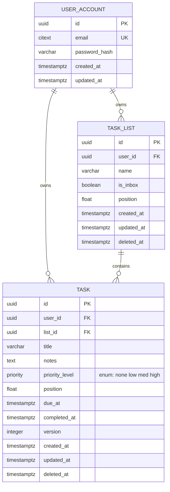

# Data Mapping

## Task Table Schema (Flyway Migration)

This story introduces the `task` table. The `user_account` and `task_list` tables are prerequisites created by prior stories (User Registration, Create a Task List).

### ER Diagram



### New Table: `task`

| Column | Type | Constraints | Notes |
|--------|------|-------------|-------|
| `id` | `UUID` | `PK DEFAULT gen_random_uuid()` | Generated UUID per AC-1 |
| `user_id` | `UUID` | `NOT NULL, FK → user_account(id)` | Tenant isolation — every query filters on this |
| `list_id` | `UUID` | `NOT NULL` | Part of composite FK for tenant safety |
| `title` | `VARCHAR(500)` | `NOT NULL` | 1–500 chars enforced by app + DB check |
| `notes` | `TEXT` | nullable | Max 10,000 chars enforced by app + DB check |
| `priority` | `priority` (PG ENUM) | `NOT NULL DEFAULT 'none'` | Reuses the custom ENUM type from locked tech stack |
| `position` | `DOUBLE PRECISION` | `NOT NULL` | Integer increment (MAX+1) for append; DOUBLE to support future midpoint reordering |
| `due_at` | `TIMESTAMPTZ` | nullable | Stored UTC, returned as ISO-8601 OffsetDateTime |
| `completed_at` | `TIMESTAMPTZ` | nullable | Null on creation per AC-1 |
| `version` | `INTEGER` | `NOT NULL DEFAULT 0` | Optimistic locking (@Version); starts at 0 per AC-1 |
| `created_at` | `TIMESTAMPTZ` | `NOT NULL DEFAULT now()` | Audit trail |
| `updated_at` | `TIMESTAMPTZ` | `NOT NULL DEFAULT now()` | Audit trail |
| `deleted_at` | `TIMESTAMPTZ` | nullable | Soft delete per locked NFR |

### Constraints

- **Composite FK**: `FOREIGN KEY (list_id, user_id) REFERENCES task_list(id, user_id)` — makes cross-tenant task creation unrepresentable at the DB level (per locked Security decision). Requires a `UNIQUE(id, user_id)` on `task_list` if not already present.
- **Check constraints**:
  - `ck_task_title_not_blank`: `CHECK (length(trim(title)) > 0)`
  - `ck_task_title_length`: `CHECK (length(title) <= 500)`
  - `ck_task_notes_length`: `CHECK (notes IS NULL OR length(notes) <= 10000)`

### Indexes

- `ix_task_list_position`: `(list_id, position) WHERE deleted_at IS NULL` — serves ordered listing and `MAX(position)` on append
- `ix_task_user_id`: `(user_id) WHERE deleted_at IS NULL` — serves tenant-scoped queries (list all user's tasks)
- `ix_task_due_at`: `(user_id, due_at) WHERE deleted_at IS NULL AND due_at IS NOT NULL` — supports due-date filtering in a later story

### Priority ENUM Type

The `priority` PostgreSQL ENUM type (`none`, `low`, `med`, `high`) is assumed to be created by an earlier migration (shared infrastructure). If not yet created, this migration adds it:
```sql
DO $$ BEGIN
    CREATE TYPE priority AS ENUM ('none', 'low', 'med', 'high');
EXCEPTION WHEN duplicate_object THEN NULL;
END $$;
```
