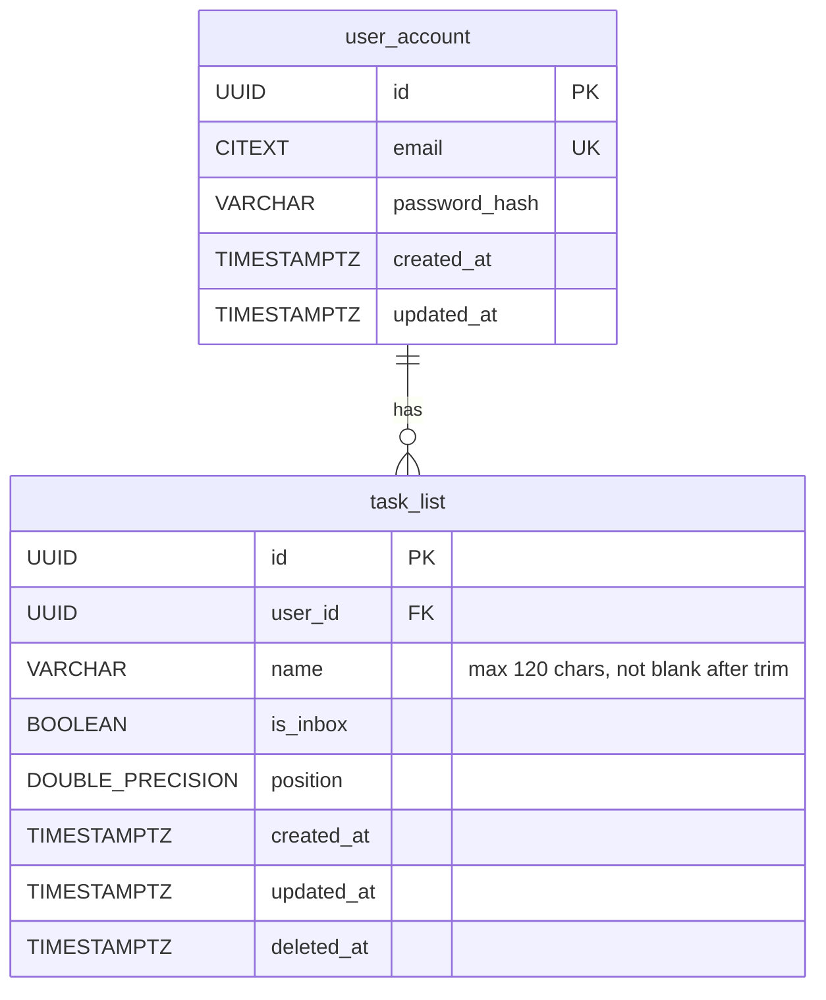

# Locked Decisions for Story 8bc1a89b-31a6-4d21-baf1-7d9c6a5973cf

## Implementation Approach
## Implementation Approach — Create a Task List

Follow the exact patterns established by the existing `TaskController` / `TaskService` flow.

### New Files

| File | Purpose |
|------|---------|
| `controller/TaskListController.java` | `@RestController` at `/v1/lists`, single `POST` method |
| `service/TaskListService.java` | Business logic: position calc, entity build, persist |
| `dto/CreateTaskListRequest.java` | Java record with Bean Validation annotations |
| `dto/TaskListResponse.java` | Java record mapping all `TaskList` fields |

### Flow (mirrors `TaskController.createTask`)

1. **Controller** receives `@Valid @RequestBody CreateTaskListRequest` + `@CurrentUser UUID userId`
2. **Service** calculates position via `TaskListRepository.findMaxPositionByUserId(userId)` (new query, returns `COALESCE(MAX(position), -1)` — same sentinel as tasks so first list gets position `0`)
3. **Service** constructs `TaskList(userId, name.trim(), false, position)` — `is_inbox` always `false` for user-created lists
4. **Service** persists via `taskListRepository.save(entity)`
5. **Service** maps to `TaskListResponse` and returns
6. **Controller** returns `ResponseEntity.created(URI.create("/v1/lists/" + id)).body(response)` — HTTP 201

### Repository Addition

Add to `TaskListRepository`:
```java
@Query("SELECT COALESCE(MAX(tl.position), -1) FROM TaskList tl WHERE tl.userId = :userId AND tl.deletedAt IS NULL")
double findMaxPositionByUserId(@Param("userId") UUID userId);
```

### Key Decisions
- **Name trimming**: `name.trim()` applied in the service before persisting — stored value is always trimmed
- **No metrics counter** for list creation (unlike `tasks_created_total`) — the PRD doesn't mention one; add later if needed
- **No `@Transactional`** needed — single-row insert, no multi-step operation
- **Auth**: Uses the existing `X-User-Id` header stub via `@CurrentUser` (JWT comes in a later story; AC-5 "401 for unauthenticated" is satisfied by the `CurrentUserArgumentResolver` throwing `IllegalStateException` when the header is missing — the `GlobalExceptionHandler` catches this as a 500 today; a dedicated 401 mapping should be added)

### 401 Handling Gap
The existing `CurrentUserArgumentResolver` throws `IllegalStateException` for missing/invalid `X-User-Id`, which the generic handler maps to 500. To satisfy AC-5, add a handler for this case in `GlobalExceptionHandler` that returns 401 with the standard error envelope. This aligns with how JWT auth will work later — missing credentials → 401.

## Data Mapping
## Data Mapping — V3 Migration for Name Constraints

The `task_list` table already exists (V1 migration). The column `name VARCHAR(255)` has **no check constraints**, but AC-1 through AC-3 require enforcing `ck_task_list_name_not_blank` and a 120-character limit. A new migration adds these.

### New Migration: `V3__add_task_list_name_constraints.sql`

```sql
-- Tighten name column from VARCHAR(255) to VARCHAR(120)
ALTER TABLE task_list ALTER COLUMN name TYPE VARCHAR(120);

-- Name must not be blank after trimming (referenced by AC-2)
ALTER TABLE task_list ADD CONSTRAINT ck_task_list_name_not_blank
    CHECK (length(trim(name)) > 0);

-- Name max length defense-in-depth (also enforced by VARCHAR(120))
ALTER TABLE task_list ADD CONSTRAINT ck_task_list_name_length
    CHECK (length(name) <= 120);
```

### No Other Schema Changes
- `task_list` columns (`id`, `user_id`, `name`, `is_inbox`, `position`, `created_at`, `updated_at`, `deleted_at`) are already correct
- Indexes (`ix_task_list_user_id`, `uq_task_list_id_user_id`) already exist
- No new tables needed

### ER Diagram (final state after V3)



### Constraint Alignment

| Constraint | DDL | Bean Validation |
|-----------|-----|-----------------|
| Not blank after trim | `ck_task_list_name_not_blank` | `@NotBlank` |
| Max 120 chars | `VARCHAR(120)` + `ck_task_list_name_length` | `@Size(max = 120)` |

Both layers enforce the same rules — the DB constraints are defense-in-depth against any bypass of the API layer.

## Validation
## Validation — Name Rules & Error Handling

### Request DTO: `CreateTaskListRequest`

```java
public record CreateTaskListRequest(
    @NotBlank(message = "Name must not be blank")
    @Size(max = 120, message = "Name must not exceed 120 characters")
    String name
)
```

Single field, two constraints. `@NotBlank` handles both null and whitespace-only (AC-2). `@Size(max = 120)` handles length overflow (AC-3).

### Validation Behavior Matrix

| Input | `@NotBlank` | `@Size` | HTTP | AC |
|-------|-----------|---------|------|-----|
| `null` | ✗ | — | 422 | AC-2 |
| `""` | ✗ | — | 422 | AC-2 |
| `"   "` | ✗ | — | 422 | AC-2 |
| `"a"` | ✓ | ✓ | 201 | AC-1 |
| 120 chars | ✓ | ✓ | 201 | AC-1 |
| 121 chars | ✓ | ✗ | 422 | AC-3 |
| Missing body | — | — | 422 | — |

### Error Response Shape

Follows the existing `GlobalExceptionHandler` pattern exactly. Example for blank name:

```json
{
  "error": {
    "code": "VALIDATION_ERROR",
    "message": "Validation failed",
    "details": [
      {
        "field": "name",
        "message": "Name must not be blank"
      }
    ]
  }
}
```

The existing `MethodArgumentNotValidException` handler already produces this format — no new exception handler needed for validation errors.

### 401 for Unauthenticated (AC-5)

Add a new handler in `GlobalExceptionHandler` for the `IllegalStateException` thrown by `CurrentUserArgumentResolver` when the `X-User-Id` header is missing. Map it to 401:

```json
{
  "error": {
    "code": "UNAUTHORIZED",
    "message": "Authentication required"
  }
}
```

This requires checking the exception message to distinguish auth-related `IllegalStateException` from others. A cleaner approach: introduce a small `AuthenticationRequiredException` (unchecked), throw it from `CurrentUserArgumentResolver`, and handle it in `GlobalExceptionHandler` with a dedicated `@ExceptionHandler`.

### Defense-in-Depth

If Bean Validation is somehow bypassed, the DB constraints (`ck_task_list_name_not_blank`, `ck_task_list_name_length`, `VARCHAR(120)`) catch it. The resulting `DataIntegrityViolationException` would hit the generic 500 handler — acceptable since this path should never be reached in practice.

## API Design
## API Design — POST /v1/lists

### Endpoint

`POST /api/v1/lists` (context path `/api` is set in `application.properties`)

### Request

**Headers:**
- `Content-Type: application/json` (required)
- `X-User-Id: {uuid}` (required — current auth stub; becomes `Authorization: Bearer` in JWT story)
- `X-Request-Id: {uuid}` (optional — auto-generated if absent)

**Body:**
```json
{
  "name": "Shopping"
}
```

Single field. No optional fields for create.

### Response — 201 Created

**Headers:**
- `Location: /v1/lists/{id}`
- `X-Request-Id: {uuid}`

**Body:**
```json
{
  "id": "a1b2c3d4-...",
  "name": "Shopping",
  "isInbox": false,
  "position": 0.0,
  "createdAt": "2026-07-31T12:00:00Z",
  "updatedAt": "2026-07-31T12:00:00Z"
}
```

### Response DTO: `TaskListResponse`

```java
public record TaskListResponse(
    UUID id,
    String name,
    boolean isInbox,
    double position,
    OffsetDateTime createdAt,
    OffsetDateTime updatedAt
)
```

Fields included: all non-sensitive, non-internal fields. `userId` and `deletedAt` are excluded — `userId` is implicit from the auth context, and `deletedAt` is null for newly created lists.

### Error Responses

| Status | Condition | Body |
|--------|-----------|------|
| 401 | Missing/invalid `X-User-Id` | `{ "error": { "code": "UNAUTHORIZED", "message": "Authentication required" } }` |
| 422 | Blank name | `{ "error": { "code": "VALIDATION_ERROR", "message": "Validation failed", "details": [{ "field": "name", "message": "Name must not be blank" }] } }` |
| 422 | Name > 120 chars | `{ "error": { "code": "VALIDATION_ERROR", "message": "Validation failed", "details": [{ "field": "name", "message": "Name must not exceed 120 characters" }] } }` |
| 422 | Missing/malformed body | `{ "error": { "code": "VALIDATION_ERROR", "message": "Validation failed", "details": [{ "message": "Malformed request body" }] } }` |

### JSON Naming Convention
Jackson default camelCase — `isInbox`, `createdAt`, `updatedAt`. Matches the existing `TaskResponse` conventions.
