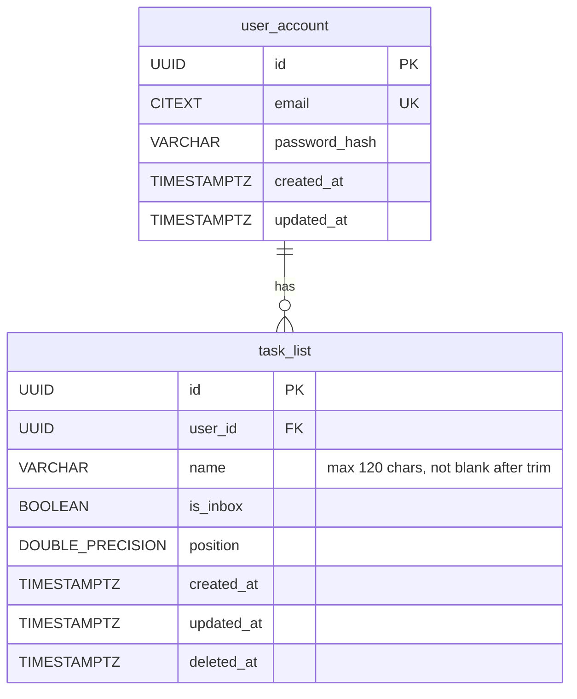

# Data Mapping

## Data Mapping — V3 Migration for Name Constraints

The `task_list` table already exists (V1 migration). The column `name VARCHAR(255)` has **no check constraints**, but AC-1 through AC-3 require enforcing `ck_task_list_name_not_blank` and a 120-character limit. A new migration adds these.

### New Migration: `V3__add_task_list_name_constraints.sql`

```sql
-- Tighten name column from VARCHAR(255) to VARCHAR(120)
ALTER TABLE task_list ALTER COLUMN name TYPE VARCHAR(120);

-- Name must not be blank after trimming (referenced by AC-2)
ALTER TABLE task_list ADD CONSTRAINT ck_task_list_name_not_blank
    CHECK (length(trim(name)) > 0);

-- Name max length defense-in-depth (also enforced by VARCHAR(120))
ALTER TABLE task_list ADD CONSTRAINT ck_task_list_name_length
    CHECK (length(name) <= 120);
```

### No Other Schema Changes
- `task_list` columns (`id`, `user_id`, `name`, `is_inbox`, `position`, `created_at`, `updated_at`, `deleted_at`) are already correct
- Indexes (`ix_task_list_user_id`, `uq_task_list_id_user_id`) already exist
- No new tables needed

### ER Diagram (final state after V3)



### Constraint Alignment

| Constraint | DDL | Bean Validation |
|-----------|-----|-----------------|
| Not blank after trim | `ck_task_list_name_not_blank` | `@NotBlank` |
| Max 120 chars | `VARCHAR(120)` + `ck_task_list_name_length` | `@Size(max = 120)` |

Both layers enforce the same rules — the DB constraints are defense-in-depth against any bypass of the API layer.
